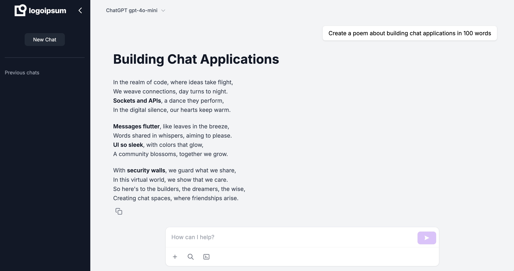

# AI Chat Application

An AI chat application built with Next.js, FastAPI, and LLM integration.

## Features

- ✅ Real-time chat interface with AI
- ✅ Markdown support for formatted responses
- 🚧 Code syntax highlighting (coming)
- 🚧 Web search integration (coming)
- 🚧 Document upload capability (coming)
- 🚧 Code interpreter (coming)
- ✅ Multiple AI model support

## Running Locally

### Prerequisites

- Node.js 18 or later
- Python 3.11 or later
- Docker and Docker Compose (optional)