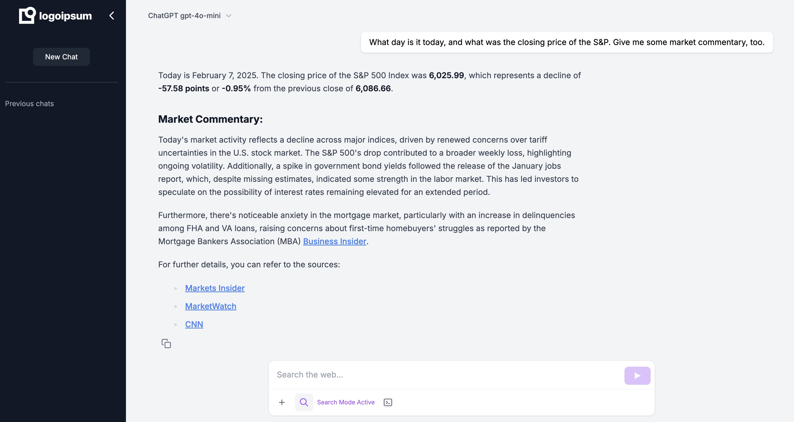

# AI Chat Assistant

An intelligent chat assistant with real-time web search capabilities.




## Features

- ✅ Real-time chat interface with AI
- ✅ Markdown support for formatted responses
- ✅ Code syntax highlighting
- ✅ Web search integration
- 🚧 Document upload capability (coming)
- 🚧 Code interpreter (coming)
- ✅ Multiple AI model support

## Running Locally

### Prerequisites

- Node.js 18 or later
- Python 3.11 or later
- Docker and Docker Compose (optional)

### Environment Setup

1. Clone the repository
```bash
git clone <repository-url>
cd ai-chat
```

2. Set up environment variables
```bash
# Copy example env files
cp .env.example .env
cp frontend/.env.example frontend/.env.local

# Edit .env file with your OpenAI API key
OPENAI_API_KEY=your-api-key-here
```

### Development

#### Using Docker (Recommended)
```bash
# Build and start containers
docker compose up --build

# Access the app at http://localhost:3000
```

#### Manual Setup

1. Backend Setup
```bash
# Create and activate virtual environment
python -m venv venv
source venv/bin/activate  # On Windows: .\venv\Scripts\activate

# Install dependencies
cd backend
pip install -r requirements.txt

# Start backend server
uvicorn app.main:app --reload --port 8000
```

2. Frontend Setup
```bash
# Install dependencies
cd frontend
npm install

# Start development server
npm run dev
```

The app will be available at:
- Frontend: http://localhost:3000
- Backend API: http://localhost:8000

## Built With

### Backend
- FastAPI - Web framework
- LangChain - LLM integration
- BeautifulSoup - Web scraping
- aiohttp - Async HTTP client

### Frontend
- Next.js - React framework
- TailwindCSS - Styling
- TypeScript - Type safety